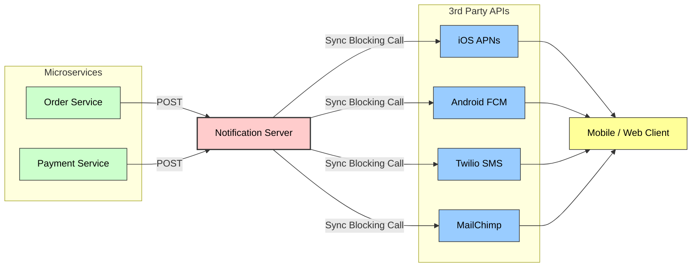
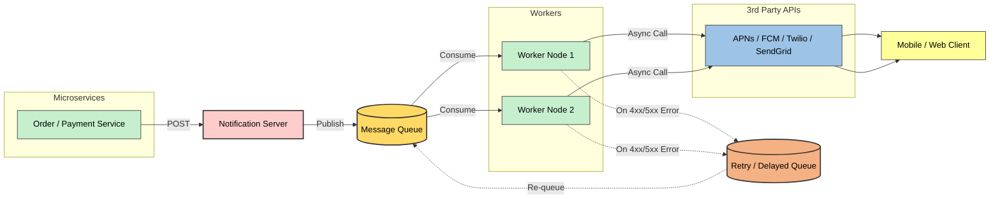
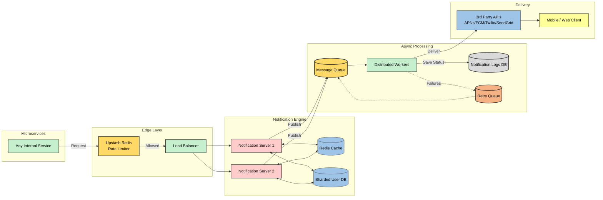
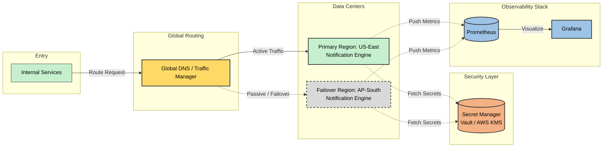

# Scalable Notification System (HLD)

A soft real-time, highly scalable notification engine designed to handle **10 Million+ daily notifications** across multiple channels (Push, SMS, Email). 

This project documents the High Level Design (HLD) evolution of a notification system, starting from a basic synchronous flow to a fully fault-tolerant, asynchronous, and horizontally scaled architecture.

## Core Features Supported
* **Channels:** iOS (APNs), Android (FCM), SMS (Twilio), Email (SendGrid/MailChimp)
* **Delivery Guarantee:** Soft real-time with at least once delivery semantics.
* **User Preferences:** Opt-in/Opt-out logic at the user level.

##  Back-of-the-Envelope Calculations

To ensure the system is architected for scale, I performed the following estimations based on a load of **1 Million Daily Active Users (DAU)**.

###  1. Notification Throughput
* **Daily Active Users (DAU):** 1,000,000
* **Average Notifications per User:** 10
* **Total Daily Volume:** 1,000,000 * 10 = **10 Million notifications/day**
* **Average QPS (Queries Per Second):** 10M / 86,400 sec ≈ **116 requests/sec**
* **Peak QPS (5x surge):** 116 * 5 ≈ **580 requests/sec**

---

###  2. Storage Requirements
* **Average Payload Size:** 200 bytes (Notification ID, Content, UserID, Timestamps)
* **Daily Storage Growth:** 10M * 200 bytes ≈ **2 GB/day**
* **Monthly Storage:** 2 GB * 30 days = **60 GB/month**
* **Retention Strategy:** Because the DB grows by ~60GB monthly, **Database Sharding** and a **TTL (Time To Live)** policy are implemented to maintain performance.

---

###  3. Bandwidth Calculations
* **Full Request Size:** ~1 KB (Includes Headers, Body, and Metadata)
* **Total Daily Data Transfer:** 10 Million * 1 KB = **10 GB/day**
* **Average Bandwidth:** 10 GB / 86,400 sec ≈ **115 KB/second**

---

## Phase 1: The Initial Synchronous Design

The simplest approach is to have internal microservices (like an Order Service or Payment Service) directly call the Notification Server, which then formats the payload and synchronously hits 3rd-party APIs.

### The Bottlenecks (Why this fails at scale):
1. **Single Point of Failure (SPOF):** If the Notification Server goes down, the entire system stops sending alerts.
2. **Synchronous Blocking:** The server waits for the 3rd-party API to respond. If APNs or Twilio is slow, our server threads get blocked, eventually leading to a crash.
3. **No Retry Logic:** If a network drop occurs during the 3rd-party API call, the notification is permanently lost.

## Phase 2: Decoupling with Message Queues (Async)

To fix the blocking issues and prevent data loss, the architecture was shifted to an event-driven, asynchronous model.

### Key Improvements:
* **Message Queues (Kafka/RabbitMQ):** The Notification Server now just pushes the payload to a queue and immediately returns a `202 Accepted` response. It no longer waits for the 3rd-party API.
* **Distributed Workers:** Independent worker nodes consume messages from the queue and handle the actual API calls to FCM/Twilio.
* **Retry Mechanism:** If a 3rd-party API returns a 4xx/5xx error, the worker pushes the message to a **Delayed/Retry Queue** to attempt delivery later, ensuring zero data loss.

## Phase 3: Scaling & Production Readiness

With the core async flow working, the system was hardened to handle high traffic surges and prevent abuse.

### Architectural Enhancements:

* **Horizontal Scaling & Load Balancing:** To handle the peak load of ~580 QPS without bottlenecking, the Notification Server itself is horizontally scaled. Multiple instances of the server are deployed behind a **Load Balancer**, ensuring high availability and completely eliminating the compute-layer SPOF.
* **Edge-Network Rate Limiting:** Implemented rate limiting using **Upstash Redis** to prevent spam and system abuse. Blocking malicious traffic at the edge saves core server CPU and memory.
* **Caching & User Preferences:** Integrated a local DB and Cache (Redis) within the notification service to quickly check user preferences (e.g., user opted out of SMS) and fetch message templates without querying external services.
* **Database Sharding:** Since notification logs grow rapidly, the database is horizontally sharded based on `userId` to maintain fast read/write speeds.
* **Notification Logs:** Added a tracking database to log the state of every message (Sent, Failed, Retrying) for analytics and customer support debugging.
* * **Resilience & Circuit Breaking:** Integrated a Circuit Breaker pattern on the distributed worker nodes to prevent thundering herd problems. If a 3rd-party vendor (e.g., Twilio) undergoes a prolonged outage, the circuit trips to fail fast, shielding the core message queues from resource exhaustion.
* **Containerized Deployment:** Packaged the notification servers and independent worker nodes into lightweight Docker containers, enabling predictable environments and rapid horizontal scaling during peak 580 QPS traffic surges.

## Phase 4: Operational Hardening
After scaling the system for production, the final step is to make it more reliable, secure, and globally resilient.

### The Enhancements (Why this matters at scale):

* **Observability & SRE Metrics:** Deployed Prometheus and Grafana to track production health using the RED method (Request Rate, Error Rates across 3rd-party APIs, and Loop Duration). Configured real-time alerts on Kafka consumer queue lag to automatically detect bottlenecks before they impact delivery timelines.

* **Security of Secrets:** API keys for Twilio, SendGrid, etc. are stored in Vault/KMS instead of code. Workers fetch them securely at runtime, preventing leaks and protecting against misuse.

* **Multi‑Region Deployment:** The system is deployed across multiple regions (e.g., US, Asia). If one region fails, traffic automatically shifts to another, ensuring notifications continue without downtime.
